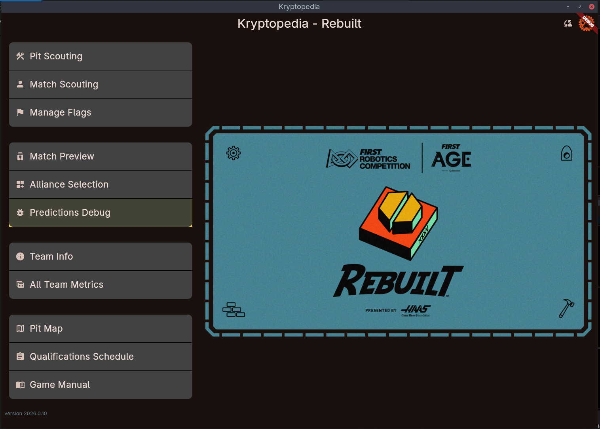
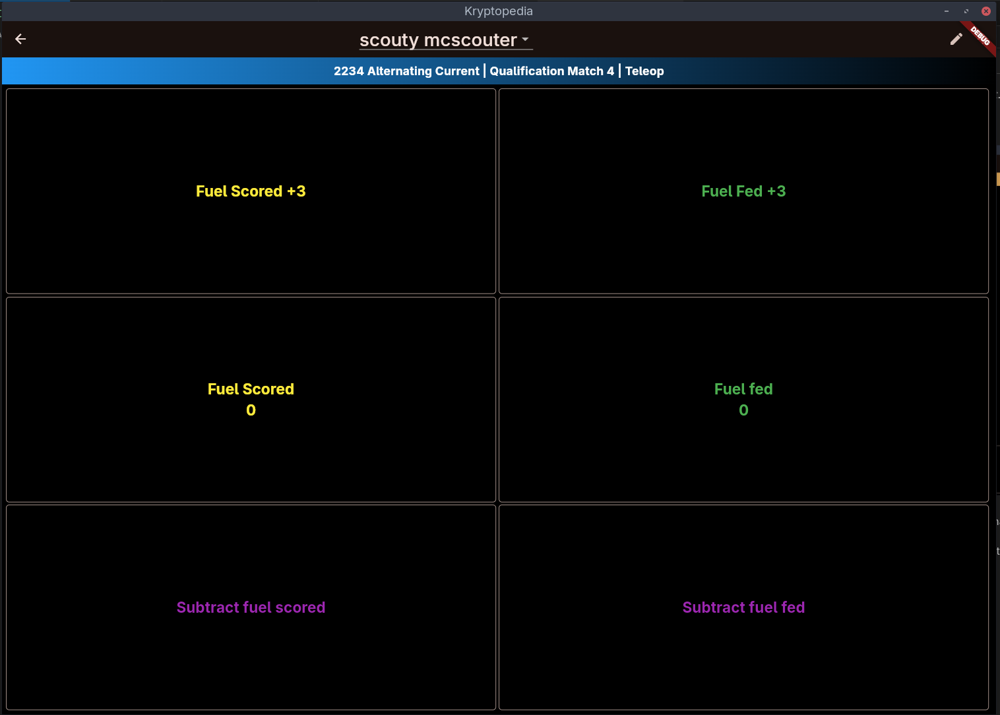
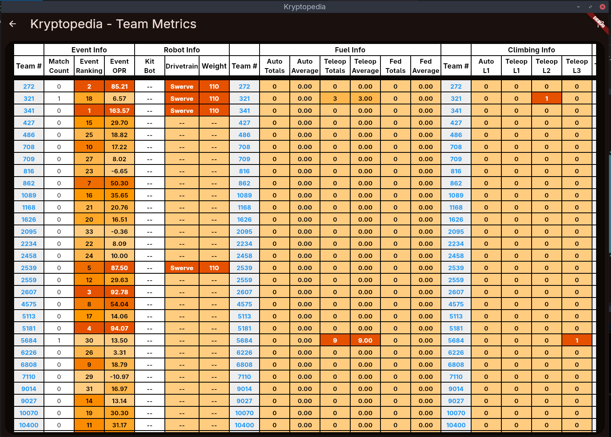
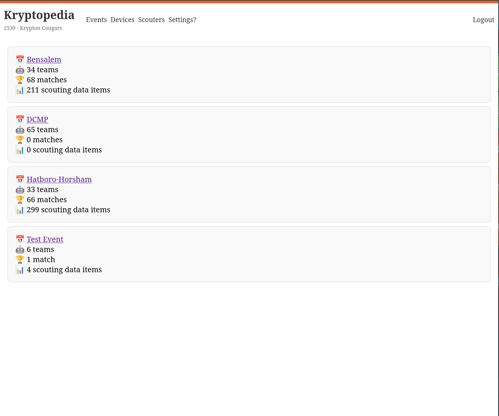

#  Kryptopedia 2026

Yet another offline-first multi-platform scouting app for the 2026 FRC game _Rebuilt_. match scouting, pit scouting, a flags system, and ways to sync the data around and look at it! by team 2539!

how many balls are going in???

|      |  |
| ---------------------------------------- | -------------------------------------- |
|  |      |

`/kryptopedia` - the app, written with Flutter. all the data collection and analysis happens here.

`/kryptopedia_dashboard` - data sync api server, and a minimal web interface for it, a Ruby on Rails app

more info about getting each set up is in their own README files. if another team actually wants to use this, please say hi on [matrix](https://matrix.to/#/@dominic:userexe.me) or [send me an email](mailto:dominic@userexe.me) :)
